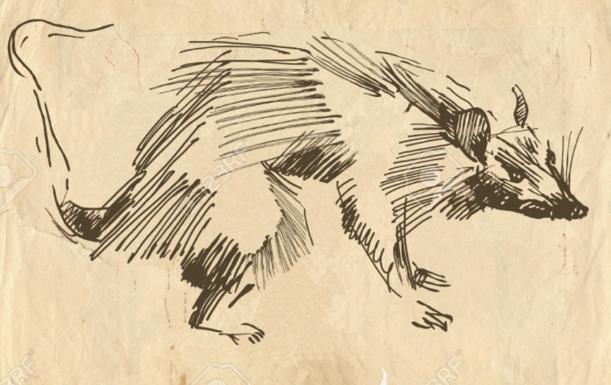

<h1 id="title" align='center'>The Rat Warz</h2>

 

  

Welcome to the Official Page of the documentation of the Rat Warz. This project serves to document the phenomena of the 
rats of baltimore as they go through a hollistic social change a chaotic run for power and control. Us baltimoreans have
experienced and witnessed rats fighting cats, fighting each other, mass forming coalitions in the streets etc. 

How can we share this with the world? The rats are hard to see and most are rumors with vivid descriptions of their classifiers. 
In this project we propose that citizens of baltimore come together to take pictures of the rats. We will then use 
a simple animal image classifier model to help us determine features of these rats and possibly get a look into the world
below us. 

To participate and eventually, perhaps a publication, your name will be added as an author if you can provide images of 
any rats and other metadata you think would be relevant in classifiying what you saw. Please file it as a "Github" Issue. 

Announcements
=============

- Oct 24th 2021, Project Initialized on Github!

Genesis
=======

After a 1 year of personal stories of the Rat Warz, I am deciding to write it down in history as part of Baltimore. Why 
not maybe this data will prove useful one day in the future for any "Rat" scientist

- Project Lead [Suliman sharif](http://sulstice.github.io/)
